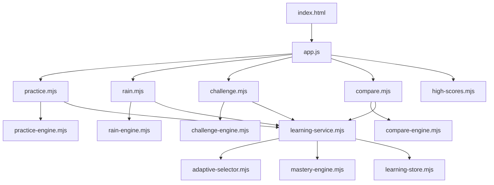

# Engine và kiến trúc

## 1. Tổng quan

Đảo Toán Vui dùng kiến trúc static client-side với ranh giới rõ giữa luật game và DOM:



Engine là module thuần: nhận state/input, cập nhật hoặc trả state/result, không dùng DOM, timer trình duyệt hay âm thanh. Controller mount UI, quản lý clock/input và gọi engine. Test nhập trực tiếp engine bằng Node.

## 2. Shell và dependency injection

`app.js` tạo một lần:

- `settings = {limit: 20, op: 'mix'}`
- `learning = createLearningService()`
- `scores = createHighScoreStore()`
- tổng sao từ `localStorage['toan-stars']`

Mỗi controller nhận context cần thiết từ shell:

```text
{ settings, home, award, beep, learning, scores }
```

`mountPractice` nhận thêm `startGame` để chuyển sang game gợi ý. `home()` luôn gọi cleanup hiện tại trước khi render menu. `start(id)` cũng cleanup trước khi mount mode khác.

## 3. Vòng đời controller

Mỗi controller tuân theo lifecycle:

1. Tạo engine state và session ID.
2. Ghi HTML gốc vào `#app`.
3. Gắn event listener.
4. Bắt đầu timer/rAF khi người chơi bấm bắt đầu hoặc ngay khi mode mở.
5. Render từ state engine.
6. Khi kết thúc, ghi high score và hiện màn kết quả.
7. Trả về `dispose()` để hủy frame/timer, delay và listener.

| Controller | Clock | Cleanup chính |
| --- | --- | --- |
| `rain.mjs` | `requestAnimationFrame` | cancel frame, feedback timeout, keyboard và visibility listener |
| `challenge.mjs` | `setInterval(..., 100)` | clear interval, pending delay, keyboard và visibility listener |
| `compare.mjs` | `requestAnimationFrame` | cancel frame, pending delay, keyboard và visibility listener |
| `practice.mjs` | `setTimeout` khi chuyển câu | clear timeout và keyboard listener |

Các controller chặn double submit bằng `locked`, `bad`, `paused`, `disposed` và `g.over` tùy flow.

## 4. Mô hình phép tính

Một fact chuẩn có dạng:

```js
{
  a: 8,
  b: 7,
  sign: '+',
  answer: 15,
  id: '8+7',
  familyId: '7+8=15',
  band: 2
}
```

### Catalog

`factCatalog()` sinh và cache 462 fact:

- 231 phép cộng `a + b` với tổng không quá 20.
- 231 phép trừ `a − b` với `0 ≤ b ≤ a ≤ 20`.

Phép cộng hoán vị và phép trừ đảo liên quan dùng chung `familyId`. Ví dụ `8+7`, `7+8`, `15−8`, `15−7` cùng family `7+8=15`.

### Band

| Band | Phạm vi |
| ---: | --- |
| 0 | 0–5 |
| 1 | 6–10 |
| 2 | 11–15 |
| 3 | 16–20 |

Band của phép cộng dựa trên kết quả; band của phép trừ dựa trên số bị trừ `a`.

`math.mjs` còn cung cấp generator đơn giản `question(limit, op)` và `choices(answer, limit)`. Engine mới nên ưu tiên facts từ `learning-service`; generator đơn giản chỉ phù hợp làm fallback hoặc tạo đáp án nhiễu.

## 5. Mastery engine

Profile phiên bản 1:

```js
{
  version: 1,
  facts: {},
  timings: {},
  createdAt,
  updatedAt
}
```

State của từng fact:

```js
{
  strength: 0,
  status: 'new',
  correct: 0,
  wrong: 0,
  hints: 0,
  reviews: 0,
  fastSessions: [],
  lastSeen: 0,
  dueAt: 0
}
```

### Evidence

| Result | Ảnh hưởng |
| --- | --- |
| Correct nhanh | `correct +1`, `strength +2`, ghi session nhanh |
| Correct chậm | `correct +1`, `strength +1` |
| Wrong | `wrong +1`, `strength −1`, sàn 0 và trần sau sai là 4 |
| Hint | `hints +1`, không tăng strength |
| Review | `reviews +1`, không tăng strength |

Một câu được coi là nhanh khi `elapsedMs` không vượt benchmark của đúng `context:band`.

- Chưa đủ 4 mẫu: benchmark mặc định 8.000 ms.
- Từ 4 mẫu: median của tối đa 12 lần đúng có timing gần nhất.
- `fastSessions` chỉ tính session ID khác nhau.

### Trạng thái

| Điều kiện | Status |
| --- | --- |
| Chưa có evidence | `new` |
| `strength ≤ 2` | `learning` |
| `strength 3–4`, hoặc chưa đủ 3 fast session | `strong` |
| `strength ≥ 5` và ít nhất 3 fast session | `mastered` |

### Lịch ôn

- Strength dưới 3: đến hạn ngay.
- Strength 3–4: đến hạn sau 1 ngày.
- Mastered: đến hạn sau 3 ngày.

`progressSummary()` duyệt toàn catalog và trả số lượng theo status, số fact đến hạn và tổng fact.

## 6. Adaptive selector

`selectFact()` chọn trong band đang mở. Profile mới bắt đầu ở band 2 (11–15). Band 3 mở khi ít nhất 70% facts band 2 đạt `strong` hoặc `mastered`.

### Filter hỗ trợ

- `kind`: `normal`, `new`, `weak`, `learning`, `due`, `hardest`.
- `excludeIds`: tránh lặp fact.
- `excludeAnswers`: tạo nhiều đáp án khác nhau, dùng cho memory.
- `sign`: chỉ cộng hoặc chỉ trừ.
- `focusSmallAddends`: chỉ cộng qua 10, kết quả trên 11, hai số hạng dưới 10.

Nếu filter quá hẹp làm pool rỗng, selector lần lượt bỏ `kind`, rồi bỏ `sign`, nhưng vẫn cố giữ các exclusion và focus có thể áp dụng.

### Trọng số normal

```text
weight = 1
       + wrong × 3
       + hints × 2
       + 3 nếu fact đã gặp và đang đến hạn
       + 2 nếu status là learning
```

`hardest` sort theo: ưu tiên fact đã gặp, strength thấp, nhiều wrong, nhiều hint, band cao, rồi ID ổn định.

## 7. Learning service và persistence

`createLearningService()` là facade duy nhất controller cần dùng:

| API | Mục đích |
| --- | --- |
| `profile` | Profile hiện tại, read-only qua getter |
| `summary()` | Tổng hợp tiến độ tại thời điểm hiện tại |
| `nextFact(options)` | Chọn fact thích ứng |
| `hardestFact(options)` | Chọn fact yếu nhất |
| `record(event)` | Ghi evidence rồi persist ngay |
| `save()` | Persist profile hiện tại |
| `reset()` | Tạo profile mới và xóa storage |
| `newSessionId()` | ID duy nhất theo timestamp + sequence |

### Storage keys

| Key | Nội dung |
| --- | --- |
| `toan-learning-v1` | Profile mastery và timing |
| `toan-high-scores-v1` | Top 5 điểm theo game |
| `toan-stars` | Tổng sao toàn app |

Storage module clone dữ liệu khi load/save, kiểm tra schema tối thiểu và tự phục hồi bằng memory fallback nếu JSON hỏng, API storage thiếu hoặc thao tác storage ném lỗi.

High score luôn chuẩn hóa score về số không âm, sort giảm dần, giữ tối đa 5 giá trị. Chỉ score lớn hơn kỷ lục cũ và lớn hơn 0 mới là kỷ lục mới.

## 8. Engine API theo game

### Rain engine

| Hàm | Vai trò |
| --- | --- |
| `createGame(options)` | Khởi tạo drops, spawn state, score, streak, 3 lives |
| `difficulty(g)` | Tính level, speed, interval, maxDrops và goldChance |
| `advance(g, dt, random, suppliers)` | Di chuyển giọt, xử lý miss, spawn fact mới, trả event |
| `submit(g, input)` | Validate input và xử lý đúng/sai/gold clear |
| `learningFact(result)` | Lấy fact đại diện từ kết quả đúng |

State được mutate tại chỗ. `advance` nhận random và fact supplier để test xác định được kết quả.

### Practice engine

| Hàm | Vai trò |
| --- | --- |
| `createPractice(options)` | Tạo danh sách câu, vị trí và counters |
| `current(g)` | Câu hiện tại hoặc `null` |
| `answer(g, value, meta)` | Ghi evidence, xếp lại nếu sai, advance nếu đúng |
| `markHint(g)` | Ghi hint và xếp lại câu |

`record` được inject khi tạo state, giúp engine không phụ thuộc storage/service.

### Challenge engine

| Hàm | Vai trò |
| --- | --- |
| `createChallenge(mode, limit)` | State chung cho bubble/mystery/memory và mode tương thích |
| `challengeDifficulty(g)` | Level, arithmetic limit, deadline, số pair, reveal, motion |
| `recordAnswer(g, good)` | Score, streak, lives, time penalty và trạng thái kết thúc |
| `elapse(g, seconds)` | Đếm giờ riêng cho mode rocket |
| `beginMemoryBoard(g)` | Reset thống kê chặng memory |
| `completeMemoryBoard(g)` | Trả bonus đúng một lần |
| `selectMemoryCard(selected, index)` | Thêm thẻ hoặc thay mismatch bằng thẻ thứ ba |
| `closeMemoryMismatch(selected, expected)` | Chỉ đóng đúng cặp đã schedule |

`challengeDifficulty()` vẫn trả `limit` tăng theo cấp để giữ contract engine và các mode tương thích. Controller hiện gọi `learning.nextFact({context})` mà không truyền `limit`; vì vậy Bubble và Mystery thực tế theo band mastery của adaptive selector. Khi muốn khôi phục progression theo range, cần mở rộng selector/service bằng filter range thay vì chỉ thay UI.

### Compare engine

| Hàm | Vai trò |
| --- | --- |
| `createCompareGame()` | Khởi tạo run 120 giây |
| `unlockedCompareStage(g)` | Stage mở theo attempts 0/5/10 |
| `compareStage(g)` | Stage thực tế sau penalty |
| `recordCompareAnswer(g, good)` | Score, streak, hạ/hồi stage |
| `elapseCompare(g, seconds)` | Đếm active time |
| `compareGap(g)` | Khoảng cách mục tiêu ở stage 3 |
| `createCompareRound(g, suppliers)` | Sinh number/mixed/fact round và đáp án |
| `reviewFacts(round, correct)` | Facts đủ điều kiện ghi review |

## 9. Timer và pause

- Controller tự quản lý wall-clock; engine chỉ nhận delta giây.
- Rain giới hạn mỗi frame delta tối đa 0,1 giây để tránh giọt nhảy xa sau lag.
- Challenge giới hạn tick delta tối đa 0,25 giây.
- Compare cố ý dùng toàn bộ active frame delta để đồng hồ 120 giây không bị kéo dài khi tab/frame chậm.
- Khi document bị ẩn, Rain, Challenge và Compare tự pause.
- Pending feedback delay chỉ chạy khi game không pause.

## 10. Testing contract

Test dùng `node:test` và `node:assert/strict`; không có DOM test runner.

- Engine test phải inject clock/random/fact supplier khi cần tính xác định.
- Test ưu tiên hành vi: score, lives, progression, range, retry, storage recovery và cleanup state.
- `home-ui.test.mjs` chỉ giữ một số guard tích hợp ở mức source cho registration, metadata và các quyết định UI từng bị regression.
- Mọi thay đổi engine phải chạy `node --test` toàn bộ trước khi deploy.
