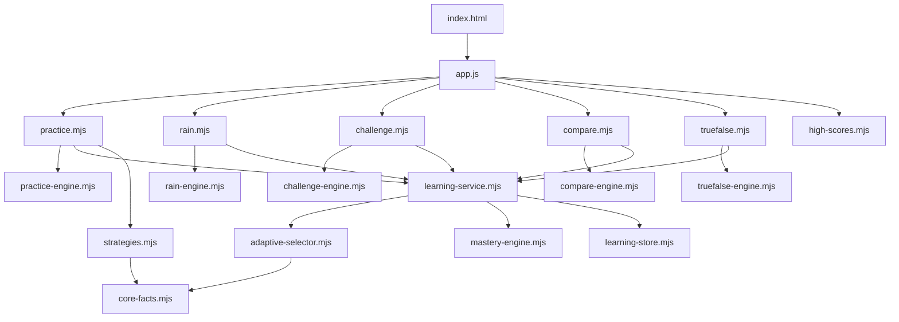

# Engine và kiến trúc

## 1. Tổng quan

Đảo Toán Vui dùng kiến trúc static client-side với ranh giới rõ giữa luật game và DOM:



Engine là module thuần: nhận state/input, cập nhật hoặc trả state/result, không dùng DOM, timer trình duyệt hay âm thanh. Controller mount UI, quản lý clock/input và gọi engine. Test nhập trực tiếp engine bằng Node.

## 2. Shell và dependency injection

`app.js` tạo một lần:

- `settings = {limit: 20, op: 'mix'}`
- `learning = createLearningService()`
- `scores = createHighScoreStore()`
- tổng sao từ `localStorage['toan-stars']`

Mỗi controller nhận context cần thiết từ shell:

```text
{ settings, home, award, beep, learning, scores }
```

`mountPractice` nhận thêm `startGame` để chuyển sang game gợi ý. `home()` luôn gọi cleanup hiện tại trước khi render menu. `start(id)` cũng cleanup trước khi mount mode khác.

## 3. Vòng đời controller

Mỗi controller tuân theo lifecycle:

1. Tạo engine state và session ID.
2. Ghi HTML gốc vào `#app`.
3. Gắn event listener.
4. Bắt đầu timer/rAF khi người chơi bấm bắt đầu hoặc ngay khi mode mở.
5. Render từ state engine.
6. Khi kết thúc, ghi high score và hiện màn kết quả.
7. Trả về `dispose()` để hủy frame/timer, delay và listener.

| Controller | Clock | Cleanup chính |
| --- | --- | --- |
| `rain.mjs` | `requestAnimationFrame` | cancel frame, feedback timeout, keyboard và visibility listener |
| `challenge.mjs` | `setInterval(..., 100)` | clear interval, pending delay, keyboard và visibility listener |
| `compare.mjs` | `requestAnimationFrame` | cancel frame, pending delay, keyboard và visibility listener |
| `truefalse.mjs` | `requestAnimationFrame` | cancel frame, pending delay, keyboard và visibility listener |
| `practice.mjs` | `setTimeout` khi chuyển câu | clear timeout và keyboard listener |

Các controller chặn double submit bằng `locked`, `bad`, `paused`, `disposed` và `g.over` tùy flow.

## 4. Mô hình phép tính

Một fact chuẩn có dạng:

```js
{
  a: 8,
  b: 7,
  sign: '+',
  answer: 15,
  id: '8+7',
  familyId: '7+8=15',
  band: 2
}
```

### Catalog

`factCatalog()` sinh và cache 462 fact:

- 231 phép cộng `a + b` với tổng không quá 20.
- 231 phép trừ `a − b` với `0 ≤ b ≤ a ≤ 20`.

Phép cộng hoán vị và phép trừ đảo liên quan dùng chung `familyId`. Ví dụ `8+7`, `7+8`, `15−8`, `15−7` cùng family `7+8=15`.

### Band

| Band | Phạm vi |
| ---: | --- |
| 0 | 0–5 |
| 1 | 6–10 |
| 2 | 11–15 |
| 3 | 16–20 |

Band của phép cộng dựa trên kết quả; band của phép trừ dựa trên số bị trừ `a`. Band chỉ còn dùng làm khóa benchmark thời gian (`context:band`); việc chọn câu đi theo giáo trình ở mục 4b.

`math.mjs` còn cung cấp generator đơn giản `question(limit, op)` và `choices(answer, limit)`. Engine mới nên ưu tiên facts từ `learning-service`; generator đơn giản chỉ phù hợp làm fallback hoặc tạo đáp án nhiễu.

### 4b. Core fact, form và giáo trình (`core-facts.mjs`)

Đơn vị học không phải một câu hỏi mà là một **core fact**: một family số kèm chiến lược tính nhẩm. `8+5`, `5+8`, `13−8`, `13−5` là bốn biến thể của cùng core fact `5+8=13`.

```js
{ id:'5+8=13', x:5, y:8, sum:13, strategy:'bridge10',
  variants:{ '+':['5+8','8+5'], '−':['13−5','13−8'] },
  forms:{ '+':form, '−':form } }
```

Một **form** là core fact × dấu; đây là khóa tiến độ (`formKey` = `familyId:sign`, ví dụ `5+8=13:+`). Phép cộng hoán vị chung tiến độ; phép trừ có tiến độ riêng vì "Trừ qua 10" là một chặng riêng.

Pool v1 gồm 35 core fact (70 form, 120 câu). Mỗi family chỉ nhận một chiến lược theo thứ tự ưu tiên:

| Chiến lược | Điều kiện (x ≤ y) | Số family |
| --- | --- | ---: |
| `make10` | x + y = 10, x ≥ 1 | 5 |
| `double` | x = y, 1..10 | 9 |
| `nearDouble` | y = x + 1, x 1..9 | 9 |
| `bridge10` | y ≤ 9, x + y ≥ 11 | 12 |

Giáo trình (`LEVELS`) gồm 5 chặng; chặng của mỗi form:

| Chặng | Tiêu đề | Form | Số form |
| ---: | --- | --- | ---: |
| 1 | Bù về 10 và số đôi nhỏ | `+` của make10 và double có tổng ≤ 10 | 9 |
| 2 | Số đôi và gần số đôi | `+` của double tổng > 10 và nearDouble | 14 |
| 3 | Cộng qua 10 | `+` của bridge10 | 12 |
| 4 | Trừ qua 10 | `−` của mọi core fact có tổng ≥ 10 | 27 |
| 5 | Trộn tất cả | mọi form (8 form trừ tổng < 10 được giới thiệu ở đây) | 70 |

`formsAtLevel(n)` trả form của chặng `n` (chặng 5 trả tất cả); `formsBelowLevel(n)` trả form của các chặng trước để ôn. Chặng 6 "Tốc độ" trong tầm nhìn sản phẩm chưa có trong code.

## 5. Mastery engine

Profile phiên bản 2:

```js
{
  version: 2,
  facts: {},      // khóa là formKey, ví dụ '5+8=13:+'
  timings: {},
  createdAt,
  updatedAt
}
```

`getFactState(profile, factOrId)` nhận object fact hoặc id câu (`'8+5'`) và tra theo form key. Profile v1 (khóa theo id câu) được `migrateProfile()` gộp khi load: cộng dồn `correct/wrong/hints/reviews`, lấy max `strength/lastSeen/dueAt`, hợp nhất `fastSessions`, rồi store ghi lại ngay ở dạng v2.

State của từng form:

```js
{
  strength: 0,
  status: 'new',
  correct: 0,
  wrong: 0,
  hints: 0,
  reviews: 0,
  fastSessions: [],
  lastSeen: 0,
  dueAt: 0
}
```

### Evidence

| Result | Ảnh hưởng |
| --- | --- |
| Correct nhanh, lần đầu sạch | `correct +1`, `strength +3`, ghi session nhanh |
| Correct nhanh (không phải lần đầu sạch) | `correct +1`, `strength +2`, ghi session nhanh |
| Correct chậm | `correct +1`, `strength +1` |
| Wrong | `wrong +1`, `strength −1`, sàn 0 và trần sau sai là 4 |
| Hint | `hints +1`, không tăng strength |
| Review | `reviews +1`, không tăng strength |

"Lần đầu sạch" là khi form chưa từng có evidence (`correct===0 && wrong===0 && hints===0`) và được trả lời nhanh — tức là lần đầu tiên làm form đó, không dùng gợi ý và trả lời đủ nhanh. Trường hợp này `strength +3`, đạt `strong` ngay trong một lần. Trần tổng `strength` là 6; trần sau sai là 4; không đổi.

Một câu được coi là nhanh khi `elapsedMs` không vượt benchmark của đúng `context:band`.

- Chưa đủ 4 mẫu: benchmark mặc định 8.000 ms.
- Từ 4 mẫu: median của tối đa 12 lần đúng có timing gần nhất.
- `fastSessions` chỉ tính session ID khác nhau.

### Trạng thái

| Điều kiện | Status |
| --- | --- |
| Chưa có evidence | `new` |
| `strength ≤ 2` | `learning` |
| `strength 3–4`, hoặc chưa đủ `MASTERY_SESSIONS` fast session | `strong` |
| `strength ≥ 5` và ít nhất `MASTERY_SESSIONS` fast session | `mastered` |

`MASTERY_SESSIONS = 2` (hằng số export từ `mastery-engine.mjs`, dùng bởi cả `statusOf` và `schedule`): cần 2 session nhanh riêng biệt để đạt `mastered`.

### Lịch ôn

- Strength dưới 3: đến hạn ngay.
- Strength 3–4: đến hạn sau 1 ngày.
- Mastered: đến hạn sau 3 ngày.

`progressSummary()` (nay nằm trong `adaptive-selector.mjs`) duyệt các form đang mở (chặng hiện tại và các chặng trước) và trả số lượng theo status, số form đến hạn, `total`, `level` hiện tại và mảng `levels[{id,title,total,ready,unlocked}]` cho UI.

## 6. Adaptive selector

`currentLevel(profile)` bắt đầu ở chặng 1; chặng N+1 mở khi ít nhất 60% form của chặng N đạt `strong` hoặc `mastered` (`levelReadiness`, hằng số `UNLOCK = 0.6`). Tối đa chặng 5.

`selectFact()` mỗi lần gọi chọn pool **focus** (form của chặng hiện tại) với xác suất 75%, còn lại pool **review** (form các chặng trước); chặng 1 và chặng 5 không có review nên luôn focus. Từ pool form lấy ra các câu biến thể rồi lọc theo filter; thứ tự `a+b` / `b+a` ngẫu nhiên vì mỗi biến thể là một câu riêng nhưng chung tiến độ.

### Filter hỗ trợ

- `kind`: `normal`, `new`, `weak`, `learning`, `due`, `hardest`. `hardest` xét cả focus lẫn review.
- `excludeIds`: tránh lặp câu.
- `excludeAnswers`: tạo nhiều đáp án khác nhau, dùng cho memory.
- `sign`: chỉ cộng hoặc chỉ trừ.
- `scope`: ép `focus` hoặc `review` thay vì rút ngẫu nhiên.
- `focusLevel`: chặng bé tự chọn cho riêng một lượt (có thể là chặng chưa mở). Khi có, pool focus là form của chặng đó, không có review, và thang fallback dừng trong chặng: không gộp chặng khác, không mượn core pool, nên có thể trả `undefined` nếu đã loại hết câu. `currentLevel()` và điều kiện mở chặng không đổi; evidence ghi như bình thường.
- `strict`: không nới rộng ra ngoài các chặng đang mở; trả `undefined` nếu hết câu.

Thang fallback khi pool rỗng: bỏ `kind` → gộp focus + review → toàn bộ core pool mọi chặng → bỏ `sign`. `excludeIds` và `excludeAnswers` luôn được giữ. Nhờ vậy Lật thẻ ở chặng 1 (chỉ 5 đáp án khác nhau) vẫn đủ 6 cặp bằng cách mượn câu từ chặng sau.

`buildPracticeSession()` tạo 18 slot theo kind (7 weak, 5 learning, 4 due, 2 new); nhận `focusLevel` và truyền xuống mọi lần gọi `selectFact()` (`createPractice({focusLevel})` dùng khi bé bấm “Luyện” ở một chặng). Với `unique: true` (Phiếu 20 phép), session không bao giờ lặp câu: khi chương trình đã mở hết câu chưa dùng, slot mượn câu của chặng kế tiếp theo thứ tự (chặng 1 chỉ có 13 câu nên phiếu chặng 1 lấy thêm 7 câu chặng 2) thay vì cho lặp. Chặng hiện tại không đổi. Mỗi slot thử `strict` với toàn bộ câu đã dùng; nếu hết thì cho lặp nhưng tránh 3 câu liền kề; cuối cùng mới nới rộng.

### Trọng số normal

```text
weight = 1
       + wrong × 3
       + hints × 2
       + 3 nếu fact đã gặp và đang đến hạn
       + 2 nếu status là learning
```

`hardest` sort theo: ưu tiên fact đã gặp, strength thấp, nhiều wrong, nhiều hint, band cao, rồi ID ổn định.

## 7. Learning service và persistence

`createLearningService()` là facade duy nhất controller cần dùng:

| API | Mục đích |
| --- | --- |
| `profile` | Profile hiện tại, read-only qua getter |
| `summary()` | Tổng hợp tiến độ tại thời điểm hiện tại |
| `nextFact(options)` | Chọn fact thích ứng |
| `hardestFact(options)` | Chọn fact yếu nhất |
| `record(event)` | Ghi evidence rồi persist ngay; `event.fact` chỉ cần `a`, `b`, `sign` (và `answer` nếu có) |
| `save()` | Persist profile hiện tại |
| `reset()` | Tạo profile mới và xóa storage |
| `newSessionId()` | ID duy nhất theo timestamp + sequence |
| `placeAt(level)` | Xếp lịch học từ chặng cho trước (xem bên dưới) |
| `skipPlacement()` | Bỏ qua placement, ghi record tối thiểu |
| `placement()` | Trả record placement đã lưu hoặc `null` |

### seedForm (mastery-engine.mjs)

`seedForm(profile, fact, now)` điền một form còn ở trạng thái `new` (chưa có evidence) với `{strength:3, status:'strong', correct:1, dueAt:now, lastSeen:now, ...}`. Nếu form đã có evidence (`correct + wrong + hints + reviews > 0`), hàm trả về state hiện tại mà không chạm vào dữ liệu — seeding chỉ thêm vào chỗ trống, không bao giờ ghi đè hay hạ cấp tiến độ thật.

### placeAt, skipPlacement, placement

`placeAt(level)`: tính `target = max(level, currentLevel(profile))`, sau đó seed tất cả form còn `new` trong `formsBelowLevel(target)` (với `target = 5` thì seed form ở chặng 1–4 vì `formsBelowLevel(5)` không rỗng; hàm persist profile rồi ghi `toan-placement-v1 = {done:true, level:max(target, prevStoredLevel), at}`. Với profile đã có tiến độ thật, `currentLevel()` có thể lớn hơn `level` truyền vào, nên hàm không đảm bảo `currentLevel() === level` sau khi gọi.

`skipPlacement()`: ghi `toan-placement-v1 = {done:true, level:1, at}` mà không đụng đến facts.

`placement()`: trả record đang lưu hoặc `null`. Schema `toan-placement-v1` được quản lý hoàn toàn bởi learning service.

### Storage keys

| Key | Nội dung |
| --- | --- |
| `toan-learning-v1` | Profile mastery và timing |
| `toan-high-scores-v1` | Top 5 điểm theo game |
| `toan-stars` | Tổng sao toàn app |
| `toan-sound` | Âm thanh `on`/`off`; thiếu key thì coi là bật |
| `toan-placement-v1` | Record placement `{done, level, at}`; schema do learning service sở hữu |

Storage module clone dữ liệu khi load/save, kiểm tra schema tối thiểu và tự phục hồi bằng memory fallback nếu JSON hỏng, API storage thiếu hoặc thao tác storage ném lỗi.

High score luôn chuẩn hóa score về số không âm, sort giảm dần, giữ tối đa 5 giá trị. Chỉ score lớn hơn kỷ lục cũ và lớn hơn 0 mới là kỷ lục mới. `record(gameId, score)` trả về `{scores, newRecord, previousBest, rank}`; `rank` là vị trí của lượt vừa ghi trong `scores` (điểm bằng nhau thì lượt mới đứng sau lượt cũ) hoặc `-1` nếu không lọt top 5, dùng để highlight “Lượt chơi hiện tại” ở màn kết thúc.

## 8. Engine API theo game

### Placement engine

`placement-engine.mjs` (thuần) và `placement.mjs` (controller) triển khai kiểm tra trình độ đầu phiên.

`placement-engine.mjs` là pure module: nhận state/input, trả state/result, không có DOM, timer hay storage.

| Hàm | Vai trò |
| --- | --- |
| `createPlacement()` | Khởi tạo state ladder `{lo:1, hi:5, place:1, step:0, done:false, level:null}` |
| `placementStage(state)` | Trả chặng cần hỏi tiếp (`floor((lo+hi)/2)`), hoặc `null` nếu đã xong |
| `recordPlacement(state, correct)` | Ghi nhận câu trả lời, cập nhật `lo`/`hi`/`place`, đặt `done=true` khi `lo > hi` |
| `placementResult(state)` | Trả `{done, level}` |

Thuật toán binary search trên 5 chặng, tối đa 3 câu hỏi, mỗi chặng được hỏi tối đa một lần. Câu hỏi probe lấy qua `learning.nextFact({focusLevel:stage, context:'placement'})` — không gọi `learning.record()`, nên probe không ghi evidence vào profile.

`placement.mjs` là controller: mount UI vào `#app`, gọi `ask()` → `render()` → `choose()` → `finish()`. Khi xong, gọi `learning.placeAt(placementResult(state).level)` và hiển thị chặng đã hạ cánh từ `learning.summary().level`.

Test: `tests/placement-engine.test.mjs`.

### Rain engine

| Hàm | Vai trò |
| --- | --- |
| `createGame(options)` | Khởi tạo drops, spawn state, score, streak, 3 lives |
| `difficulty(g)` | Tính level, speed, interval, maxDrops và goldChance |
| `advance(g, dt, random, suppliers)` | Di chuyển giọt, xử lý miss, spawn fact mới, trả event |
| `submit(g, input)` | Validate input và xử lý đúng/sai/gold clear |
| `learningFact(result)` | Lấy fact đại diện từ kết quả đúng |

State được mutate tại chỗ. `advance` nhận random và fact supplier để test xác định được kết quả.

### Practice engine

| Hàm | Vai trò |
| --- | --- |
| `createPractice(options)` | Tạo danh sách câu, vị trí và counters |
| `current(g)` | Câu hiện tại hoặc `null` |
| `answer(g, value, meta)` | Ghi evidence, xếp lại nếu sai, advance nếu đúng |
| `markHint(g)` | Ghi hint và xếp lại câu |

`record` được inject khi tạo state, giúp engine không phụ thuộc storage/service.

### Strategies

`strategyHint(question)` trong `strategies.mjs` là hàm thuần trả `{strategy, lines, dots:{total,from,mode}, frame}` cho `practice.mjs` render gợi ý: `make10` dùng khung 10 ô, `double`/`nearDouble` giải thích mẫu số đôi, `bridge10` tách qua 10 hai bước (cả cộng lẫn trừ), câu ngoài core pool quay về đếm chấm.

### Challenge engine

| Hàm | Vai trò |
| --- | --- |
| `createChallenge(mode, limit)` | State chung cho bubble/mystery/memory và mode tương thích |
| `challengeDifficulty(g)` | Level, arithmetic limit, deadline, số pair, reveal, motion |
| `recordAnswer(g, good)` | Score, streak, lives, time penalty và trạng thái kết thúc |
| `elapse(g, seconds)` | Đếm giờ riêng cho mode rocket |
| `beginMemoryBoard(g)` | Reset thống kê chặng memory |
| `completeMemoryBoard(g)` | Trả bonus đúng một lần |
| `selectMemoryCard(selected, index)` | Thêm thẻ hoặc thay mismatch bằng thẻ thứ ba |
| `closeMemoryMismatch(selected, expected)` | Chỉ đóng đúng cặp đã schedule |

`challengeDifficulty()` vẫn trả `limit` tăng theo cấp để giữ contract engine và các mode tương thích. Controller hiện gọi `learning.nextFact({context})` mà không truyền `limit`; vì vậy Bubble và Mystery thực tế theo band mastery của adaptive selector. Khi muốn khôi phục progression theo range, cần mở rộng selector/service bằng filter range thay vì chỉ thay UI.

### Compare engine

| Hàm | Vai trò |
| --- | --- |
| `createCompareGame()` | Khởi tạo run 90 giây |
| `unlockedCompareStage(g)` | Stage mở theo attempts 0/5/10 |
| `compareStage(g)` | Stage thực tế sau penalty |
| `recordCompareAnswer(g, good)` | Score, streak, hạ/hồi stage |
| `elapseCompare(g, seconds)` | Đếm active time |
| `compareGap(g)` | Khoảng cách mục tiêu ở stage 3 |
| `createCompareRound(g, suppliers)` | Sinh number/mixed/fact round và đáp án |
| `reviewFacts(round, correct)` | Facts đủ điều kiện ghi review |

### True/false engine

| Hàm | Vai trò |
| --- | --- |
| `createTrueFalseGame()` | Khởi tạo run 90 giây |
| `unlockedTrueFalseStage(g)` | Stage mở theo thời gian đã chơi 0/30/60 giây |
| `trueFalseStage(g)` | Stage thực tế sau penalty |
| `recordTrueFalseAnswer(g, good)` | Score, streak, hạ/hồi stage |
| `elapseTrueFalse(g, seconds)` | Đếm active time |
| `createTrueFalseRound(g, suppliers)` | Vế trái từ fact supplier, vế phải là số hoặc phép tính, và `truth` |
| `reviewFacts(round, correct)` | Phép tính vế trái khi round đúng |

## 9. Timer và pause

- Controller tự quản lý wall-clock; engine chỉ nhận delta giây.
- Rain giới hạn mỗi frame delta tối đa 0,1 giây để tránh giọt nhảy xa sau lag.
- Challenge giới hạn tick delta tối đa 0,25 giây.
- Compare và Đúng hay sai cố ý dùng toàn bộ active frame delta để đồng hồ 90 giây không bị kéo dài khi tab/frame chậm.
- Khi document bị ẩn, Rain, Challenge, Compare và Đúng hay sai tự pause.
- Pending feedback delay chỉ chạy khi game không pause.

## 10. Testing contract

Test dùng `node:test` và `node:assert/strict`; không có DOM test runner.

- Engine test phải inject clock/random/fact supplier khi cần tính xác định.
- Test ưu tiên hành vi: score, lives, progression, range, retry, storage recovery và cleanup state.
- `home-ui.test.mjs` chỉ giữ một số guard tích hợp ở mức source cho registration, metadata và các quyết định UI từng bị regression.
- `placement-engine.test.mjs` kiểm tra toàn bộ hành vi binary-search: path đúng hết, sai hết, sai rồi đúng, và giới hạn 3 câu / 1 lần mỗi chặng.
- Mọi thay đổi engine phải chạy `node --test` toàn bộ trước khi deploy.
